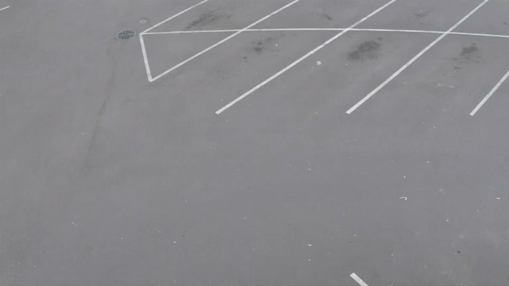
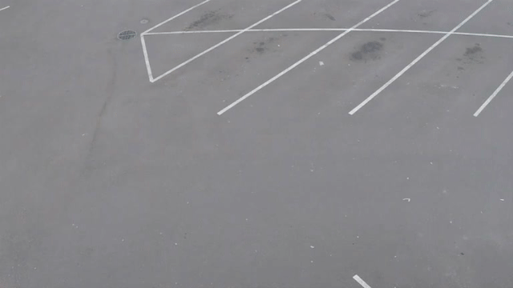

# Практическое занятие №2 — детекция объектов и семантическая сегментация видеоряда

Конвейер: видео → кадры (ffmpeg, 3 fps) → YOLOv8n (детекция) + YOLOv8n-seg (семантическая сегментация) → две анимированные GIF.

## Результаты

| Детекция объектов (`out/detection.gif`) | Семантическая сегментация (`out/segmentation.gif`) |
|---|---|
|  |  |

Видео: 20-секундный фрагмент (30–50 с) тестового ролика [person-bicycle-car-detection.mp4](https://github.com/intel-iot-devkit/sample-videos) из набора Intel IoT DevKit, 768×432.

| Артефакт | Где лежит |
|---|---|
| Исходное видео (фрагмент 20 с) | `input.mp4` |
| Список пакетов окружения | `packages.txt` |
| Скриншоты окружения | `docs/screenshots/` |
| Извлечённые кадры (60 шт.) | `frames/`, общий вид — `docs/frames_contact_sheet.jpg` |
| Результаты детекции по кадрам (класс, confidence, bbox) | `out/det_json/*.json` |
| Карты классов сегментации по кадрам (пиксель = id класса COCO, 255 = фон) | `out/seg_masks/*.png`, пример в цвете — `docs/mask_example_frame_0055.png` |
| Кадры с рамками / с масками | `out/det_frames/`, `out/seg_frames/` |
| GIF №1 и №2 | `out/detection.gif`, `out/segmentation.gif` |